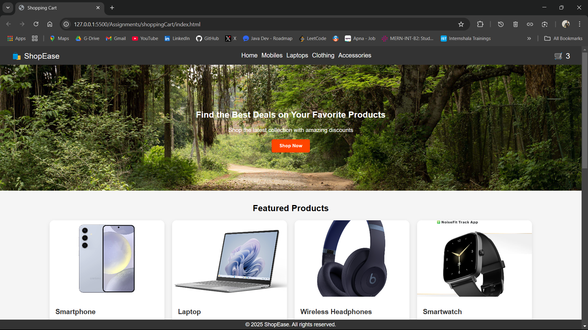
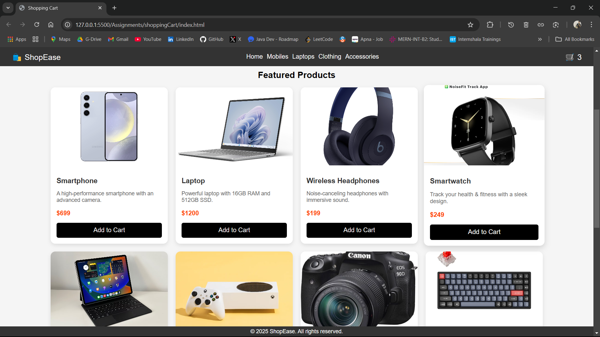
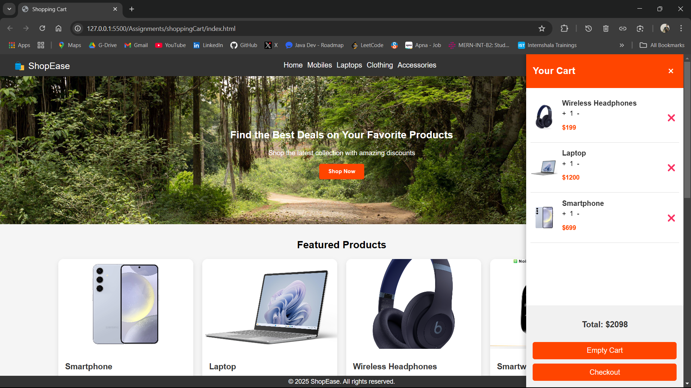

# 🛒 Shopping Cart Web Application

## 📌 Project Overview
This project is a **Shopping Cart Web Application** built using **HTML, CSS, and JavaScript**. It allows users to browse products, add items to the cart, update quantities, remove items, and view the total price dynamically. The cart data is stored in **localStorage**, ensuring persistence across page reloads. The UI is interactive, responsive, and designed to enhance user experience. 

---

## 🚀 Features

✅ **Product Listing** – Displays items with **images, names, descriptions, and prices**.  
✅ **Add to Cart** – Click a button to add products to the cart.  
✅ **Dynamic Cart** – Updates quantities, removes items, and calculates totals dynamically.  
✅ **Cart Persistence** – Uses **localStorage** to save cart data between page reloads.  
✅ **Interactive Cart UI** – A **sliding cart panel** for easy viewing (right side on desktops, bottom on mobile).  
✅ **Modern & Responsive UI** – Built using **CSS Flexbox & Grid** for a clean and engaging experience.  
✅ **Smooth Animations** – Adds hover effects, sliding transitions, and interactive buttons.  
✅ **Empty Cart Button** – Clears all cart items instantly.  

---

## 🏗️ Tech Stack

- **Frontend:** HTML5, CSS3, JavaScript (ES6+)
- **Styling:** Flexbox, Grid, Animations, Transitions
- **Storage:** localStorage (for cart persistence)

---

## 📷 Screenshots

### 🔹 Home Page


### 🔹 Product Listing


### 🔹 Shopping Cart (Opened)


---

## ⚙️ Installation & Usage

1️⃣ **Clone the Repository**  
```bash
git clone https://github.com/tejasambore/shoppingCart.git
```

2️⃣ **Open the Project**  
Navigate to the project folder and open `index.html` in a browser.

3️⃣ **Start Using the Shopping Cart!**  
- Click "Add to Cart" to add products.
- Click the cart icon 🛒 to view the cart.
- Increase, decrease quantity or remove items.
- The cart persists across page reloads.

---

## 🛠️ Future Enhancements
🚀 **Add User Authentication** – Implement user login to save cart data across devices.  
🚀 **Backend Integration** – Connect to a backend (Node.js/Express) for real data handling.  
🚀 **Checkout Process** – Enable payments with a gateway (Stripe, PayPal).  
🚀 **Search & Filter** – Improve product discovery with filtering options.  

---

## 📝 License
This project is open-source and available under the **MIT License**.

---

## 🙌 Acknowledgments
I would like to thank [**Innomatics Research Labs**] (https://innomatics.in) for this opportunity to work on a real-world web development project. Looking forward to more exciting challenges ahead! 🎯

---

## 🔗 GitHub Repository
[**View Source Code**](https://github.com/tejasambore/shoppingCart.git)

---

## 👨‍💻 Created By
**Tejas Govind Ambore**
- Full Stack Developer Intern at [**Innomatics Research Labs**](https://innomatics.in)
- **LinkedIn:** [Tejas Ambore](https://www.linkedin.com/in/tejasambore)
- **GitHub:** [Tejas Ambore](https://github.com/tejasambore)


💬 Feel free to fork, contribute, and share your feedback! 🚀
